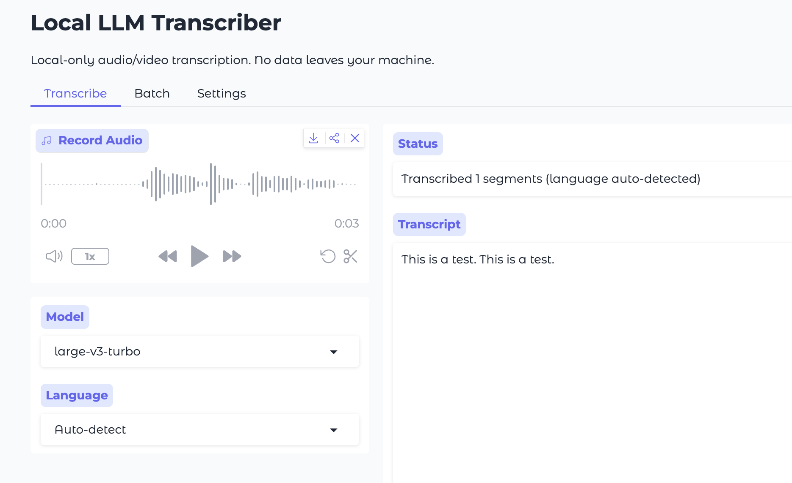

# Local LLM Transcriber

Local-only transcription with summarization for your private voice notes. No data leaves your machine.

[]

## Features

- Audio/video transcription using Whisper
- AI summaries with Ollama (optional)
- Batch processing multiple files

## Requirements

- Python 3.10+
- [uv](https://docs.astral.sh/uv/) for dependency management
- [Ollama](https://ollama.ai) (optional, for summaries)

## Quick Start

```bash
# Install dependencies
uv sync

# Run the app
uv run python app.py
```

The app will open in your browser automatically.

## Ollama Setup (Optional)

For AI-powered transcript summaries:

```bash
# Install Ollama from https://ollama.ai

# Pull a recommended model
ollama pull qwen2.5:7b
```

Recommended models for summarization:
- **qwen3:8b** - Best balance of quality and speed

## Usage

1. **Transcribe**: Record or upload audio, select model and language
2. **Summarize**: Use Ollama to generate AI summaries
3. **Batch**: Process multiple files at once
4. **Export**: Download transcripts in your preferred format
5. **Settings**: Manage Whisper models and Ollama configuration
